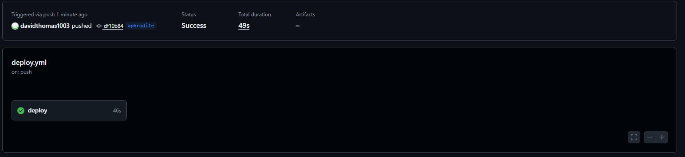
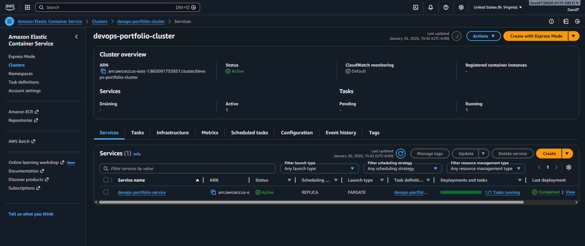

# DevOps Portfolio — ECS Fargate CI/CD

## Overview
This repository demonstrates a production-style DevOps workflow using AWS, Terraform, Docker, and GitHub Actions.

## Architecture
- Dockerized application
- Amazon ECR
- Amazon ECS (Fargate)
- Terraform (Infrastructure as Code)
- GitHub Actions (CI/CD)

## Architecture Diagram

## Pipeline Example

*GitHub Actions deploying container to ECS successfully*

## Running App

*Flask app served via ECS Fargate*

## CI/CD Pipeline
- Build Docker image
- Push image to Amazon ECR
- Terraform plan on pull requests
- Terraform apply on main branch

## Branch Strategy
- aphrodite: staging/testing
- main: production (protected)

## Security
- GitHub Secrets for AWS credentials
- Branch protection enabled
 
